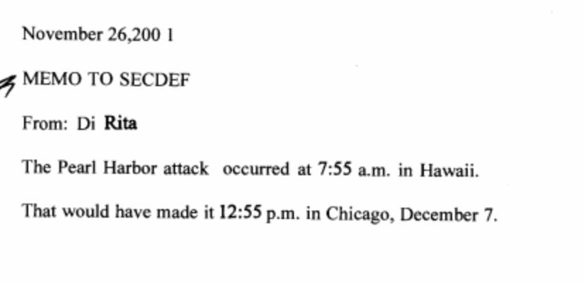

`Temporal`

  Fixing Date APIs in JavaScript
  Started 2 years ago by Date/Time experts in JavaScript
  Currently Stage-2 going for Stage-3 in February (hopefully)
  Polyfill available (published to NPM next week)

---

`Temporal` API

  Absolute - an actual point in time
  TimeZone - a representation of time-zone data
  Duration - a period of time (time-difference)
  DateTime - a representation of Date & Time with no timezone
  Date / Time / YearMonth / MonthDay

---

`Temporal` advantages

  Immutable objects
  Correctness Possible
  Time-Zone handling explicit

---


---



---

```javascript
let PH = (new Temporal.DateTime(2001, 11, 26, 7, 55)).withZone('Pacific/Honolulu');
console.log(PH.toString('Pacific/Honolulu') + ' => ' + PH.toString('America/Chicago'));
```

<div style="font-size: 0.7em;">

> 2001-11-26T07:55:00-10:00[Pacific/Honolulu] => 2001-11-26T11:55:00-06:00[America/Chicago]

</div>

---

```javascript
let PH = (new Temporal.DateTime(2001, 12, 7, 7, 55)).withZone('Pacific/Honolulu');
console.log(PH.toString('Pacific/Honolulu') + ' => ' + PH.toString('America/Chicago'));
```

<div style="font-size: 0.7em;">

> 2001-12-07T07:55:00-10:00[Pacific/Honolulu] => 2001-12-07T11:55:00-06:00[America/Chicago]

</div>

---

```javascript
let PH = (new Temporal.DateTime(1941, 12, 7, 7, 55)).withZone('Pacific/Honolulu');
console.log(PH.toString('Pacific/Honolulu') + ' => ' + PH.toString('America/Chicago'));
```
<div style="font-size: 0.7em;">

> 1941-12-07T07:55:00-10:30[Pacific/Honolulu] => 1941-12-07T12:25:00-06:00[America/Chicago]

</div>