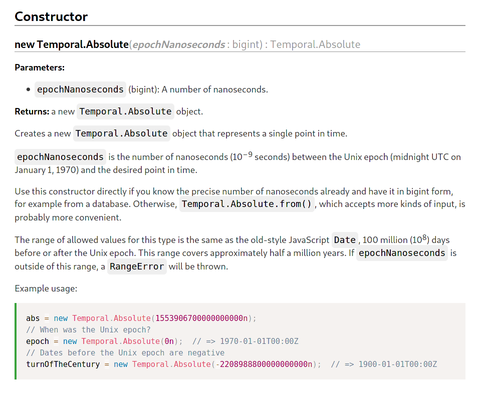
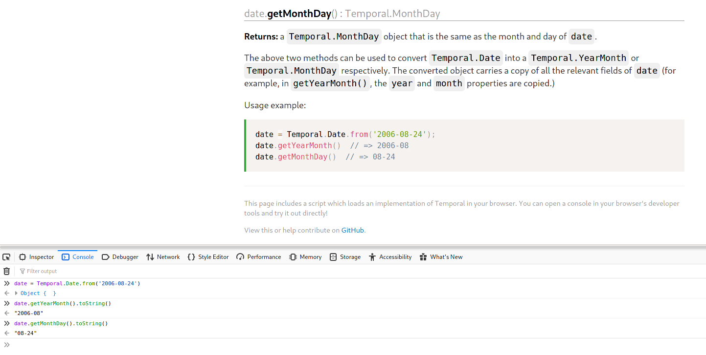

<style>
section.names ul ul li {
  font-size: 22px;
  display: inline-block;
  margin-right: 10px;
  list-style: disc;
}

section.cookbook img {
  width: 70%;
}

section.constructor img {
  width: 65%;
}

section.roadmap ul li:nth-child(3), section.roadmap ul li:nth-child(5) {
      margin-bottom: 40px;
}
</style>

# Temporal 🕓

## Update 2020-03-31

- Intro
- Spec draft
- Polyfill
- Cookbook
- Documentation
- Calendar
- Feedback
- Roadmap

---

<!-- _header: 'Intro' -->
<!-- _class: names -->

# Intro

What's new since last time?

- More participants

  - Daniel Ehrenberg
  - Jason Williams
  - Jordan Harband
  - Maggie Johnson-Pint
  - Matt Johnson-Pint
  - Ms2ger
  - Philip Chimento
  - Philipp Dunkel
  - Richard Gibson
  - Sasha Pierson
  - Shane F. Carr
  - Ujjwal Sharma
  - kaizhu256

- Cookbook https://tc39.es/proposal-temporal/docs/cookbook.html
- API Documentation https://tc39.es/proposal-temporal/docs/index.html

<!--
We've had a lot of new people join since i last gave an updated.
We now have input from:

* Apple
* Bloomberg
* Google
* Igalia
* Microsoft

--->

---

# Spec draft

- Gaps continuing to be filled in
- Much better alignment with polyfill
- https://tc39.es/proposal-temporal/

---

# Polyfill

- Get a Node environment with the Temporal polyfill:
  - `git clone https://github.com/tc39/proposal-temporal`
  - `cd proposal-temporal/polyfill`
  - `npm install`
  - `npm run playground`
- Test262 test suite being built up
- Few things missing:
  - custom calendars
  - custom time zones
  - `Temporal.parse()`?
- https://github.com/tc39/proposal-temporal/tree/main/polyfill

---

# Cookbook

- Examples of "How do I do ... with Temporal?"
- Most commonly asked questions on Stack Overflow for legacy `Date`
- Use cases gathered from conversations
- https://tc39.es/proposal-temporal/docs/cookbook.html

<!--
So one of the things brought up last time was (Leo) a request for better examples of the API in general, and showing some use-cases.

So we have worked on a cookbook.
These are some of the most common tasks that people ask questions about on StackOverflow with legacy Date. Here's how they would look using Temporal.

Some examples are:
* Getting the unix timestamp
* Getting the current date and time
* How can i sort or compare dates with each other.
* Given a month and year, how do I get the first tuesday of the month?
 -->

---

<!-- _class: cookbook -->


---

<!-- _header: 'Documentation' -->

# Documentation

- Reference documentation for the API of Temporal
- In the style of MDN; easy for casual readers to understand the proposal
- Reflects the current state of the polyfill
- Open your browser console on this page and the Temporal polyfill is loaded in your environment
- https://tc39.es/proposal-temporal/docs/index.html

---

<!-- _class: constructor -->



---



---

<!-- _header: 'Calendar' -->

# `Temporal.Calendar`

---

<!-- _header: 'Calendar' -->

## Welcome to Temporal! Let's start programming.

---

<!-- _header: 'Calendar' -->

```javascript
let date = Temporal.now.date();
console.log(
  d.toLocaleString("en-US-u-ca-hebrew", {
    day: "numeric",
    month: "long",
    year: "numeric"
  })
);
// 'Nisan 6, 5780'

date = date.plus({ months: 1 });
console.log(
  d.toLocaleString("en-US-u-ca-hebrew", {
    day: "numeric",
    month: "long",
    year: "numeric"
  })
);
// 'Iyar 6, 5780'

date = date.plus({ months: 1 });
console.log(
  d.toLocaleString("en-US-u-ca-hebrew", {
    day: "numeric",
    month: "long",
    year: "numeric"
  })
);
// 'Sivan 7, 5780'

// 'Tamuz 8, 5780'
// 'Av 9, 5780'
// 'Elul 10, 5780'
// 'Tishri 12, 5781'

date = date.plus({ years: 1 });
console.log(
  d.toLocaleString("en-US-u-ca-hebrew", {
    day: "numeric",
    month: "long",
    year: "numeric"
  })
);
// 'Tishri 24, 5782'

date = date.plus({ years: 1 });
console.log(
  d.toLocaleString("en-US-u-ca-hebrew", {
    day: "numeric",
    month: "long",
    year: "numeric"
  })
);
// 'Tishri 5, 5783'
```

---

<!-- _header: 'Calendar' -->

- While everyone in 2020 mostly agrees with the concept of a solar day, months and years are concepts that are inherently calendar-dependent.
- Any date-time arithmetic that is rooted in the ISO calendar involving months and years is bound to give unexpected results that will carry over poorly to other calendars.
- TL:DR; any arithmetic with units larger than days cannot be satisfactorily done in a calendar-agnostic way.

---

<!-- _header: 'Calendar' -->

## We cannot have our cake and eat it too.

---

<!-- _header: 'Calendar' -->

## What are our options?


---

<!-- _header: 'Calendar' -->

## What even is `Temporal.Calendar`?

- Mechanism to allow arbitrary calendar systems to be implemented on top of Temporal.
- This will be taken care of for _most_ users out of the box, and doesn't require any extra know-how.
- Can be used to implement non-built-in calendar systems.
- Plan to expose non-ISO, commonly-used regional calendars via ECMA-402.
- Everything else in userland.

---

<!-- _header: 'Calendar' -->

## What even is `Temporal.Calendar`?

### How does it look like?

```typescript
class MyCalendar extends Temporal.Calendar {
  id: string;

  // Projection
  toISO(input: Temporal.Date): Temporal.Date;
  fromISO(input: Temporal.Date): Temporal.Date;

  // Construction
  dateFromFields(fields: object): Temporal.Date;

  // Arithmetic
  plus(
    input: Temporal.Date,
    duration: Temporal.Duration,
    options: object
  ): Temporal.Date;
  minus(
    input: Temporal.Date,
    duration: Temporal.Duration,
    options: object
  ): Temporal.Date;
  difference(
    left: Temporal.Date,
    right: Temporal.Date,
    options: object
  ): Temporal.Duration;

  // Accessors
}
```

---

<!-- _header: 'Calendar' -->

## What even is `Temporal.Calendar`?

### How will it work? (using `Temporal.Date` as an example)

<ul style="font-size: 80%">
<li>Previously, <code>Temporal.Date</code> had three internal slots: year, month and day.
<li>Now, it has four slots: <code>[[IsoYear]]</code>, <code>[[IsoMonth]]</code>, <code>[[IsoDay]]</code> and <code>[[Calendar]]</code>.
<li>The corresponding fields on <code>Temporal.Date.prototype</code> should forward requests to the calendar.
<li>Calendars <em>can</em> add calendar-specific accessors, eg: <code>yearType</code> for the Hebrew Calendar.
<li>An instance is expected to have stateless behavior; i.e., all methods should be deterministic.
</ul>

---

<!-- _header: 'Calendar' -->

## What even is `Temporal.Calendar`?

### How would people use it?

```javascript
let date = Temporal.now.date(); // a Temporal.Date

console.log(date.withCalendar("iso").month); // 11, i.e. November
console.log(date.withCalendar("hebrew").month); // 2, i.e. Heshvan
console.log(date.withCalendar("japanese").era); // "reiwa"
```

---

<!-- _header: 'Calendar' -->

## What even is `Temporal.Calendar`?

### How would people use it?

```javascript
let date = Temporal.now.date();

console.log(
  d.toLocaleString("en-US-u-ca-hebrew", {
    day: "numeric",
    month: "long",
    year: "numeric"
  })
);
// 'Nisan 7, 5780'

date = date.withCalendar("hebrew");

date = date.plus({ months: 1 });
console.log(
  d.toLocaleString("en-US-u-ca-hebrew", {
    day: "numeric",
    month: "long",
    year: "numeric"
  })
);
// 'Iyar 7, 5780'

date = date.plus({ months: 1 });
console.log(
  d.toLocaleString("en-US-u-ca-hebrew", {
    day: "numeric",
    month: "long",
    year: "numeric"
  })
);
// 'Sivan 7, 5780'

// 'Tamuz 7, 5780'
// 'Av 7, 5780'
// 'Elul 7, 5780'
// 'Tishri 7, 5781'
```

---

<!-- _header: 'Calendar' -->

## What even is `Temporal.Calendar`?

### What about Lunar and Lunisolar calendars?

- `Temporal.Date` has three components: `Year`, `Month` and `Day`.
- Take out any one, and it becomes impossible to perform Calendar conversions.
- Example: Rosh Hashanah, 1 Tishrei in the Hebrew Calendar.
  - 2019: 30th September
  - 2020: 19th September
  - 2021: 7th September
  - 2022: 26th September
- Question: Eid al-Fitr, 1 Shawwal in the Islamic Calendar.
- Answer: Don't even ask.

---

<!-- _header: 'Calendar' -->

## What even is `Temporal.Calendar`?

### What about Lunar and Lunisolar calendars?

- The above model solves all remaining issues with solar calendars.
- Lunar and Lunisolar calendars don't have clear overlaps with ISO, therefore need more information to properly disambiguate.
- We will add a `[[RefIsoYear]]` and `[[RefIsoDay]]` slot to `Temporal.MonthDay` and `Temporal.YearMonth` classes respectively, to assist disambiguation.
- They will be ignored whenever they're not required.

---

<!-- _header: 'Calendar' -->

## Next Steps

- Reach consensus on the last few standing issues.
- Convert working draft into proper spec text.
- Add calendar support to polyfill.

---

# Feedback

<!-- _header: 'Feedback' -->

---

<!-- _class: roadmap -->

# Roadmap

<!--

So you could break our roadmap up into 3 parts:

* Finalizing things
* Gathering feedback
* Eventually ask for advancement to Stage 3

 -->

- Finalize polyfill and release it
- Finalize first edition of the cookbook
- Finalize Specification

- Incorporate decisions & feedback
- TC39 stage review / edit specification to reflect

- Request TC39 stage advancement
